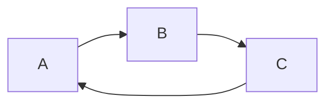

# Repo to store my personal blog

Built using [Jekyll][1] and hosted on [GitHub pages][2] at https://flynnbops.github.io/

## Build locally
Run `bundle exec jekyll serve` to make changes.
Site is available on `http://127.0.0.1:4000/` by default.

## Edit drafts
Drafts are files that do not include a date in their filename. Stored in `/drafts`.

Build the site with the drafts flag to Run `bundle exec jekyll serve --drafts`.
The currently edited draft post is automatically the latest post.

## Linking to other posts
Use the jeykll `link` to define a relative path from the root directory to the link. Not a relative path from the file calling the link.
For example:
```ruby
    
```

## Using Mermaid
I've added support for [mermaid diagrams][3] with the [jekyll-spaceship][4] plugin. Mermaid diagrams can be included within code block markdown.



[1]: https://jekyllrb.com/docs/
[2]: https://pages.github.com/
[3]: https://github.com/mermaid-js/mermaid#readme
[4]: https://github.com/jeffreytse/jekyll-spaceship#4-mermaid-usage