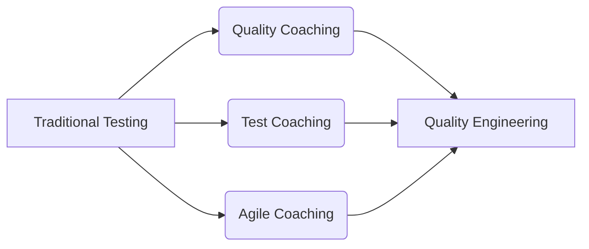

[MOT Bloggers Club August 2022][1]

> The Future Of The Tester Role

I'm going to talk about my views on the direction(s) testing will move in future.

## My past and present
I won't go into great detail, but the past informs the present and future. I'm struck by the similarities to [Ben Dowen's own background][2]. I wonder if there's wider correlation. Worth a chat over coffee...

These are all views from my own experience, which doesn't deny your own experience in different contexts.

### In a Test team
I've been in a "test team" testing software after its been developed. Generally using manual test scripts, and reporting on test cases and defects. Contact with the developers was non-existent, and we were `providers of information`, and any meaningful impact on quality was difficult.

I've also worked on creating automated test scripts in these environments. Often converting existing manual scripts to automated scripts.

I call this `Traditional testing` for brevity.

### Multidisciplinary teams
I've worked in teams that varied in `agility`, so decided the makeup of the team was more important than if we were "agile" or not.

Working closely with other roles to build software, proved to be a much better approach then I previously experienced. Being part of the conversations before and during development, allowed more opportunities for `testing` earlier. Stuff broadly in the `shift left` camp. For example, I could ask questions on unclear requirements, input into approach and suggest test ideas.

Being part of the team, I could more directly influence what we were doing. We could do better, and a broader range of testing as a team. We wanted to do more than `basic functional testing`. We looked at more quality attributes. This involved lots of what I'd now loosely call `Quality Coaching`

This allowed us all to expand what testing `we knew how to do`, and learn more about what we didn't. We talked about testing, and how we could test things. Lots of test ideas, that we could turn into good tests, when we thought about test design, and `what do we want to test here`. Something I'd now loosely call `Test Coaching`.

### Management and people stuff
I've worked as a test manager, community lead and line manager over the years. These responsibilities helped me look outside of one team and more broadly. Whether thats for an individuals growth, or that of the whole test community.

People are funny creatures and learning how to work well with people is a vital skill. Develop your; mentoring, coaching and the art persuasion, and you'll be mighty indeed.

## What does the future hold?
You may have noticed lots of `coaching` mentioned in the previous section. I always see testers doing actual testing. I believe the best value of testers is to support good testing. Which means doing some of it themselves, and enabling others to do some.

*Fig.1 Image showing the how testing flows into different coaching options and quality*

I personally believe things like [modern testing principles][3], and [whole team approaches to quality][4], will lead to `Quality Engineering`. By that I mean, practices and approaches that put `quality` into the whole `engineering` lifecycle. Meaning we do things better, and make better things for our users.

## Predictions
I've not talked about many if any specifics in this post, so thought I'd try some possibly wild predictions

- Low code automation tools will increase in popularity and adoption
- Due to the low barrier to entry, lots of tests will be created, but overall test design will be poor, and maintenance will be a nightmare.
- This will lead to (re)adoption of code based tools.
- There will still be a large market for more `traditional testing` roles.

### Appendix
My mermaid diagram didn't generate as expected so falling back to an image. Keeping the original `mermaid` code for reference.

[1]: https://club.ministryoftesting.com/t/bloggers-club-august-2022-the-future-of-the-tester-role/61680
[2]: https://dowen.me.uk/the-future-of-software-testing/
[3]: https://www.moderntesting.org/
[4]: https://lisacrispin.com/2011/04/26/the-whole-team-approach-in-practice/