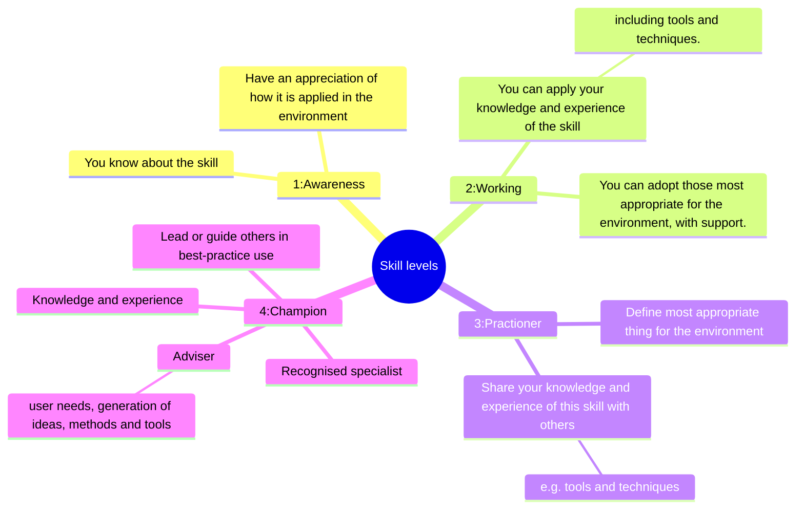

[MOT Bloggers Club October 2023][1]

> How do you approach continuous learning?

This is my first post in a long time. Lots of interesting life stuff happened over the past few months. Including my wedding and our "Family-moon" adventure.
I'm leaning on the MoT Bloggers club (as usual) to help get me back writing. Getting started again can be hard.

## How do I generally learn?
Good to look at how I learn first.

Variety of resources, platforms, media.

Good success when I've aligned my learning goals with other work that needs doing. e.g. Docker int tests.
I'm guilty of letting this drift, and get to the point my learning isn't very "continuous", or perhaps it's fairer to say it's not "deliberate" enough.

## How much do I want / need to learn?
Enough to do what I need. How deep to go?
Enough that I have "Awareness - Working" level of proficiency

## What support do I use?

Great resources online, that I'll refer to, and tailor for myself. e.g. MoT paths, TAU pathways, even Pluralsight

Kept a small repo of links that I've found useful, in the hope that I'll have those references when I need them next.

## Appendix

[1]: https://club.ministryoftesting.com/t/bloggers-club-share-your-blog-post-october-2023/70896
